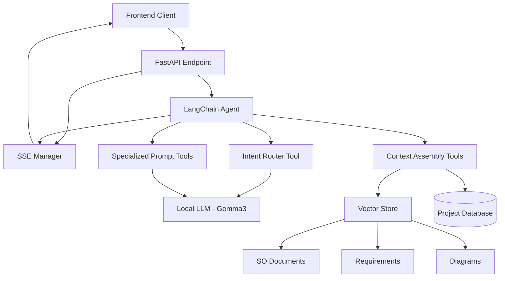

# Design Document: LLM Routing & SSE Response System

## Overview

This design document outlines the architecture for implementing an intelligent LLM routing and SSE response system for the SO Assistant. The system uses a LangChain Agent to detect user intent, route to appropriate specialized prompts, gather relevant context through RAG, and stream structured responses back to the UI via Server-Sent Events.

The system supports four main intents:
- `integration_check`: Analyze consistency between SO sections and diagrams
- `requirements_coverage`: Map requirements to SO/diagram coverage
- `improve_paragraph`: Provide targeted rewrite suggestions for SO sections
- `qna`: Answer general questions using available context

## Architecture

### High-Level Architecture



### Component Architecture

The system follows a layered architecture with clear separation of concerns:

1. **API Layer**: FastAPI endpoint handling SSE connections
2. **Agent Layer**: LangChain Agent orchestrating the workflow
3. **Tool Layer**: Specialized tools for routing, RAG, and prompt execution
4. **Service Layer**: Business logic for document processing and analysis
5. **Data Layer**: Vector store and database for context retrieval

## Components and Interfaces

### Core Components

#### 1. LangChain Agent Orchestrator

The main orchestrator that coordinates the entire workflow:

```python
class SOAssistantAgent:
    def __init__(self, llm, tools, sse_manager):
        self.agent = create_react_agent(llm, tools, prompt_template)
        self.executor = AgentExecutor(
            agent=self.agent,
            tools=tools,
            verbose=True,
            handle_parsing_errors=True,
            max_iterations=5
        )
        self.sse_manager = sse_manager
    
    async def process_query(self, project_id: str, user_message: str, 
                          client_id: str, routing_override: Optional[str] = None) -> None:
        """Process user query through the agent workflow."""
        
    async def stream_agent_execution(self, inputs: dict, client_id: str) -> None:
        """Stream agent execution progress via SSE."""
```

#### 2. Intent Router Tool

Specialized tool for detecting user intent and extracting targets:

```python
class IntentRouterTool(BaseTool):
    name = "intent_router"
    description = "Analyze user query to detect intent and extract target IDs"
    
    def _run(self, user_message: str, language: str = "auto") -> dict:
        """
        Returns:
        {
            "intent": "integration_check|requirements_coverage|improve_paragraph|qna",
            "targets": {
                "so_ids": ["SEC-..."],
                "requirement_ids": ["REQ-..."], 
                "diagram_ids": ["SEQ-...", "C4-..."]
            },
            "confidence": 0.0-1.0,
            "reason": "short rationale"
        }
        """
        
    async def _arun(self, user_message: str, language: str = "auto") -> dict:
        """Async version for streaming support."""
```

#### 3. Context Assembly Tools

Tools for retrieving and assembling relevant project context:

```python
class SOSectionRetrievalTool(BaseTool):
    name = "retrieve_so_sections"
    description = "Retrieve Solution Outline sections by ID"
    
    def _run(self, project_id: str, section_ids: List[str], 
             include_neighbors: bool = False) -> dict:
        """Retrieve SO sections with optional neighboring context."""

class RequirementRetrievalTool(BaseTool):
    name = "retrieve_requirements"
    description = "Retrieve requirements by ID or semantic search"
    
    def _run(self, project_id: str, requirement_ids: List[str] = None,
             query: str = None, max_results: int = 5) -> dict:
        """Retrieve requirements with metadata."""

class DiagramRetrievalTool(BaseTool):
    name = "retrieve_diagrams"
    description = "Retrieve and parse diagrams by ID"
    
    def _run(self, project_id: str, diagram_ids: List[str]) -> dict:
        """
        Returns parsed diagram data:
        - For SEQ-*: participant interactions, message flows, steps
        - For C4-*: systems, containers, components, relationships
        """

class ChatSummaryTool(BaseTool):
    name = "get_chat_summary"
    description = "Get recent chat interaction summary"
    
    def _run(self, project_id: str, last_n_messages: int = 10) -> str:
        """Get summarized chat history for context."""
```

#### 4. Specialized Prompt Execution Tools

Tools for executing intent-specific prompts:

```python
class IntegrationCheckTool(BaseTool):
    name = "integration_check_analysis"
    description = "Analyze integration consistency between SO and diagrams"
    
    def _run(self, context: dict) -> dict:
        """
        Returns structured JSON with suggestions schema:
        {
            "suggestions": [...],
            "scores": {...},
            "status": "ok|insufficient"
        }
        """

class RequirementsCoverageTool(BaseTool):
    name = "requirements_coverage_analysis"
    description = "Analyze requirements coverage in SO and diagrams"
    
    def _run(self, context: dict) -> dict:
        """Returns structured coverage analysis."""

class ParagraphImprovementTool(BaseTool):
    name = "paragraph_improvement_analysis"
    description = "Provide targeted improvement suggestions for SO paragraphs"
    
    def _run(self, context: dict) -> dict:
        """Returns structured improvement suggestions."""

class QnATool(BaseTool):
    name = "qna_response"
    description = "Answer general questions using provided context"
    
    def _run(self, context: dict, question: str) -> str:
        """Returns plain text answer or 'INSUFFICIENT'."""
```

#### 5. SSE Manager

Enhanced SSE manager for streaming agent execution:

```python
class AgentSSEManager:
    def __init__(self):
        self.clients: Dict[str, asyncio.Queue] = {}
        self.request_trackers: Dict[str, RequestTracker] = {}
    
    async def stream_agent_execution(self, client_id: str, agent_executor: AgentExecutor,
                                   inputs: dict) -> None:
        """Stream agent execution with different event types."""
        
    async def send_start_event(self, client_id: str, intent: str, targets: dict) -> None:
        """Send initial processing event."""
        
    async def send_token_event(self, client_id: str, delta: str) -> None:
        """Send incremental content token."""
        
    async def send_json_event(self, client_id: str, partial_json: dict) -> None:
        """Send partial JSON for structured responses."""
        
    async def send_final_event(self, client_id: str, result: dict, metrics: dict) -> None:
        """Send final result with metrics."""
        
    async def send_error_event(self, client_id: str, error: str, trace_id: str) -> None:
        """Send error event with trace information."""
```

### API Endpoints

#### Main Query Endpoint

```python
@router.post("/projects/{project_id}/assistant/query")
async def process_assistant_query(
    project_id: str,
    request: AssistantQueryRequest,
    background_tasks: BackgroundTasks
) -> EventSourceResponse:
    """
    Process assistant query with SSE streaming.
    
    Request body:
    {
        "user_message": "text",
        "routing_override": "integration_check|requirements_coverage|improve_paragraph|qna|null"
    }
    
    Response: text/event-stream with events:
    - start: metadata for session
    - token: progressive content
    - json: partial JSON chunks
    - final: complete result + metrics
    - error: error with trace ID
    """
```

## Data Models

### Request/Response Schemas

```python
class AssistantQueryRequest(BaseModel):
    user_message: str = Field(..., description="User query text")
    routing_override: Optional[str] = Field(None, description="Force specific intent")

class RouterOutput(BaseModel):
    intent: str = Field(..., description="Detected intent")
    targets: Dict[str, List[str]] = Field(..., description="Target IDs")
    confidence: float = Field(..., ge=0.0, le=1.0, description="Confidence score")
    reason: str = Field(..., description="Rationale for intent")

class SuggestionEvidence(BaseModel):
    requirements: List[str] = Field(default_factory=list, description="REQ-* IDs")
    diagrams: List[Dict[str, Any]] = Field(default_factory=list, description="Diagram references")
    so_quotes: List[str] = Field(default_factory=list, description="SO excerpts")

class Suggestion(BaseModel):
    id: str = Field(..., description="Unique suggestion ID")
    type: str = Field(..., description="Suggestion type")
    severity: str = Field(..., description="info|minor|major|critical")
    location: Dict[str, Any] = Field(..., description="Location reference")
    summary: str = Field(..., description="One-line summary")
    rationale: str = Field(..., description="Why this suggestion")
    evidence: SuggestionEvidence = Field(..., description="Supporting evidence")
    recommendation: str = Field(..., description="What to do")
    proposed_text: Optional[str] = Field(None, description="Full rewrite if applicable")
    confidence: float = Field(..., ge=0.0, le=1.0, description="Confidence score")

class AnalysisScores(BaseModel):
    integration_consistency: float = Field(..., ge=0.0, le=1.0)
    requirements_coverage: float = Field(..., ge=0.0, le=1.0)
    security_readiness: float = Field(..., ge=0.0, le=1.0)
    operability: float = Field(..., ge=0.0, le=1.0)

class StructuredResponse(BaseModel):
    suggestions: List[Suggestion] = Field(default_factory=list)
    scores: AnalysisScores = Field(...)
    status: str = Field(..., description="ok|insufficient")
```

### Document Models

```python
class SOSection(BaseModel):
    id: str = Field(..., description="SEC-* identifier")
    title: str = Field(..., description="Section title")
    content: str = Field(..., description="Section content")
    parent_id: Optional[str] = Field(None, description="Parent section ID")
    level: int = Field(..., description="Nesting level")

class ParsedSequenceDiagram(BaseModel):
    id: str = Field(..., description="SEQ-* identifier")
    participants: List[str] = Field(..., description="Diagram participants")
    interactions: List[Dict[str, Any]] = Field(..., description="Message flows")
    steps: List[Dict[str, Any]] = Field(..., description="Ordered steps")

class ParsedC4Diagram(BaseModel):
    id: str = Field(..., description="C4-* identifier")
    diagram_type: str = Field(..., description="Context|Container|Component|Dynamic|Deployment")
    systems: List[Dict[str, Any]] = Field(default_factory=list)
    containers: List[Dict[str, Any]] = Field(default_factory=list)
    components: List[Dict[str, Any]] = Field(default_factory=list)
    relationships: List[Dict[str, Any]] = Field(..., description="Component relationships")
```

## Implementation Strategy

### Phase 1: Core Infrastructure

1. **Agent Setup**
   - Configure LangChain Agent with local LLM (Gemma3)
   - Implement basic tool framework
   - Set up SSE streaming infrastructure

2. **Intent Router Implementation**
   - Create intent detection prompts (Greek/English support)
   - Implement target ID extraction logic
   - Add confidence scoring mechanism

3. **Basic Context Assembly**
   - Implement SO section retrieval
   - Add requirements retrieval
   - Create chat summary functionality

### Phase 2: Diagram Processing

1. **Sequence Diagram Parser**
   - Parse Mermaid sequence syntax
   - Extract participant interactions and message flows
   - Generate analyzable triples

2. **C4 Diagram Parser**
   - Parse C4 diagram syntax
   - Extract systems, containers, components
   - Map relationships and dependencies

3. **Vector Store Integration**
   - Index parsed diagram content
   - Implement semantic search for diagrams
   - Add diagram-to-SO correlation

### Phase 3: Specialized Analysis Tools

1. **Integration Check Tool**
   - Compare SO architecture sections with diagrams
   - Identify consistency gaps
   - Generate structured suggestions

2. **Requirements Coverage Tool**
   - Map requirements to SO sections
   - Analyze coverage completeness
   - Identify missing mappings

3. **Paragraph Improvement Tool**
   - Analyze specific SO sections
   - Generate targeted improvement suggestions
   - Provide rewrite recommendations

### Phase 4: Advanced Features

1. **Performance Optimization**
   - Implement caching for parsed diagrams
   - Add request deduplication
   - Optimize vector search performance

2. **Observability and Monitoring**
   - Add comprehensive logging
   - Implement request tracing
   - Create performance metrics

3. **Configuration Management**
   - Add feature flags for intents
   - Implement configurable limits
   - Support language profiles

## Error Handling and Resilience

### Error Scenarios

1. **Intent Detection Failures**
   - Fallback to `qna` intent with low confidence
   - Log detection failure for analysis
   - Provide user feedback about uncertainty

2. **Context Assembly Failures**
   - Graceful degradation with partial context
   - Clear messaging about missing information
   - Retry mechanisms for transient failures

3. **LLM Processing Errors**
   - Timeout handling with user-friendly messages
   - JSON schema validation with retry logic
   - Fallback responses for critical failures

4. **SSE Connection Issues**
   - Connection drop detection and cleanup
   - Reconnection support
   - Message queuing for reliability

### Retry and Fallback Logic

```python
class RetryConfig:
    max_retries: int = 1
    timeout_seconds: int = 30
    backoff_multiplier: float = 1.5

async def execute_with_retry(tool_func, inputs, config: RetryConfig):
    """Execute tool function with retry logic and timeout handling."""
    
async def validate_json_response(response: str, schema: Type[BaseModel]) -> dict:
    """Validate and parse JSON response with retry on schema violations."""
```

## Performance Considerations

### Latency Targets

- **First Token Time**: < 2s for `qna`, < 3s for structured routes
- **Total Response Time**: < 15s for contexts up to 30k tokens
- **Context Assembly**: < 1s for document retrieval
- **Diagram Parsing**: < 500ms per diagram

### Optimization Strategies

1. **Caching**
   - Cache parsed diagrams by content hash
   - Cache vector embeddings for documents
   - Cache intent detection results for similar queries

2. **Parallel Processing**
   - Concurrent context retrieval for different document types
   - Parallel diagram parsing for multiple diagrams
   - Asynchronous SSE event streaming

3. **Resource Management**
   - Connection pooling for database access
   - LLM request queuing and rate limiting
   - Memory management for large contexts

## Security and Privacy

### Data Isolation

- Project-scoped context retrieval
- User session isolation
- Secure vector store access

### PII Protection

- Automatic PII redaction in logs
- Secure handling of sensitive content
- Audit trail for data access

### Configuration Security

- Secure storage of LLM credentials
- Environment-based configuration
- Access control for administrative functions

## Testing Strategy

### Unit Testing

1. **Tool Testing**
   - Mock LLM responses for consistent testing
   - Test intent detection with various inputs
   - Validate context assembly logic

2. **Parser Testing**
   - Test diagram parsing with various Mermaid syntax
   - Validate extracted triples and relationships
   - Test error handling for malformed diagrams

### Integration Testing

1. **Agent Workflow Testing**
   - End-to-end agent execution
   - SSE streaming validation
   - Error scenario testing

2. **Performance Testing**
   - Load testing for concurrent requests
   - Latency measurement under various conditions
   - Memory usage profiling

### Contract Testing

1. **JSON Schema Validation**
   - Validate all structured response formats
   - Test schema evolution compatibility
   - Verify error response formats

2. **API Contract Testing**
   - SSE event format validation
   - Request/response schema compliance
   - Error handling consistency

## Deployment and Operations

### Configuration Management

```python
class AgentConfig:
    # LLM Configuration
    model_name: str = "gemma3"
    temperature: float = 0.1
    max_tokens: int = 4096
    timeout_seconds: int = 30
    
    # Context Limits
    max_so_chunks: int = 8
    max_diagrams: int = 2
    max_requirements: int = 10
    
    # Feature Flags
    enable_integration_check: bool = True
    enable_requirements_coverage: bool = True
    enable_improve_paragraph: bool = True
    enable_qna: bool = True
    
    # Language Support
    supported_languages: List[str] = ["el", "en"]
    default_language: str = "auto"
```

### Monitoring and Observability

1. **Metrics Collection**
   - Request success/failure rates
   - Latency percentiles (50th, 95th, 99th)
   - Token throughput and processing time
   - Intent detection accuracy

2. **Logging Strategy**
   - Structured logging with correlation IDs
   - Request/response payload logging (with PII redaction)
   - Performance timing at each stage
   - Error details with stack traces

3. **Health Checks**
   - LLM connectivity and response time
   - Vector store availability
   - Database connection health
   - SSE connection management status

## Conclusion

This design provides a comprehensive architecture for implementing the LLM routing and SSE response system. The modular approach with LangChain agents and specialized tools ensures flexibility and maintainability while meeting the performance and functionality requirements.

The phased implementation strategy allows for incremental development and testing, while the robust error handling and monitoring ensure production readiness.