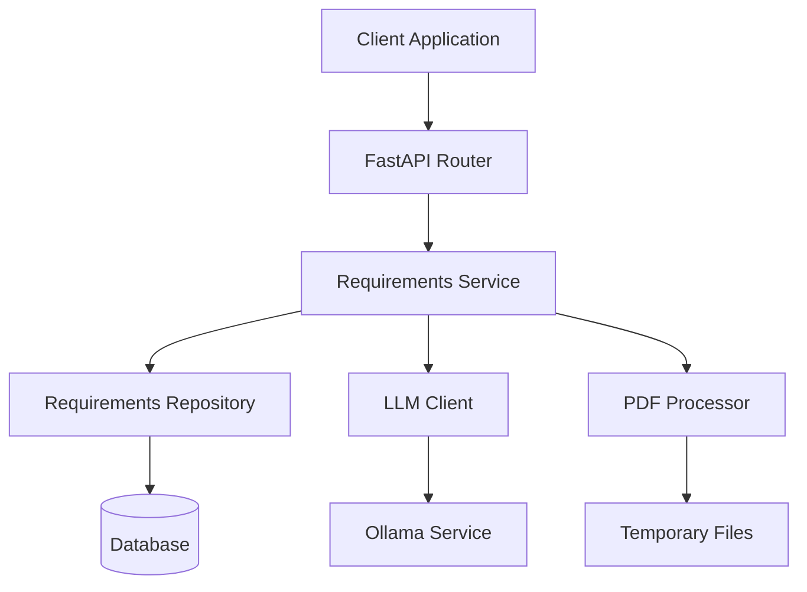

# Design Document

## Overview

This design document outlines the architecture and implementation details for enhancing the requirements management system with versioning capabilities and PDF upload functionality. The design builds upon the existing solution outline versioning pattern and integrates LLM-powered PDF processing to provide a comprehensive requirements management solution.

## Architecture

### High-Level Architecture



### Component Overview

1. **API Layer**: FastAPI routers handling HTTP requests
2. **Service Layer**: Business logic for requirements management and PDF processing
3. **Repository Layer**: Data access and versioning logic
4. **LLM Integration**: PDF to markdown conversion using existing LLM client
5. **PDF Processing**: Text extraction and file handling utilities
6. **Database Layer**: Enhanced requirements model with versioning support

## Components and Interfaces

### Enhanced Requirements Model

```python
class RequirementDocument(Base):
    """Versioned requirements document model."""
    __tablename__ = "requirement_documents"
    
    id = Column(Integer, primary_key=True, index=True)
    project_id = Column(String(255), ForeignKey("projects.id"), nullable=False)
    content = Column(Text, nullable=False)  # Markdown content
    version = Column(Integer, nullable=False)
    status = Column(Enum(RequirementStatus), default=RequirementStatus.draft)
    source_type = Column(Enum(SourceType), default=SourceType.manual)  # manual, pdf_upload
    original_filename = Column(String(255), nullable=True)  # For PDF uploads
    created_at = Column(DateTime, default=datetime.utcnow)
    updated_at = Column(DateTime, default=datetime.utcnow, onupdate=datetime.utcnow)
    
    # Relationships
    project = relationship("Project", back_populates="requirement_documents")

class SourceType(enum.Enum):
    """Source type for requirements."""
    manual = "manual"
    pdf_upload = "pdf_upload"

class RequirementStatus(enum.Enum):
    """Requirement document status."""
    draft = "draft"
    published = "published"
    archived = "archived"
```

### API Endpoints

```python
# Requirements Document Management
@router.post("/projects/{project_id}/requirements")
async def upsert_requirements(
    project_id: str,
    content: str = Query(...),
    status: RequirementStatus = Query(RequirementStatus.draft)
) -> RequirementDocumentResponse

@router.get("/projects/{project_id}/requirements/latest")
async def get_latest_requirements(project_id: str) -> RequirementDocumentResponse

@router.get("/projects/{project_id}/requirements/{version}")
async def get_requirements_by_version(
    project_id: str, 
    version: int
) -> RequirementDocumentResponse

@router.get("/projects/{project_id}/requirements")
async def get_requirements_versions(
    project_id: str,
    pagination: PaginationParams
) -> PaginatedResponse[RequirementDocumentResponse]

# PDF Upload and Processing
@router.post("/projects/{project_id}/requirements/upload-pdf")
async def upload_requirements_pdf(
    project_id: str,
    file: UploadFile = File(...),
    status: RequirementStatus = Query(RequirementStatus.draft)
) -> RequirementDocumentResponse
```

### Service Layer Design

```python
class RequirementDocumentService:
    """Service for managing versioned requirements documents."""
    
    def __init__(self, db: Session):
        self.db = db
        self.repository = RequirementDocumentRepository()
        self.project_repository = ProjectRepository()
        self.llm_client = StreamingOllamaClient()
        self.pdf_processor = PDFProcessor()
    
    async def upsert_requirements(
        self, 
        project_id: str, 
        content: str, 
        status: RequirementStatus = RequirementStatus.draft,
        source_type: SourceType = SourceType.manual,
        original_filename: Optional[str] = None
    ) -> RequirementDocument:
        """Create or update requirements document with versioning."""
        
    async def process_pdf_upload(
        self,
        project_id: str,
        file: UploadFile,
        status: RequirementStatus = RequirementStatus.draft
    ) -> RequirementDocument:
        """Process uploaded PDF and convert to requirements document."""
        
    def get_latest_requirements(self, project_id: str) -> RequirementDocument:
        """Get latest requirements or return empty document."""
        
    def get_requirements_by_version(
        self, 
        project_id: str, 
        version: int
    ) -> RequirementDocument:
        """Get specific version of requirements document."""
```

### PDF Processing Component

```python
class PDFProcessor:
    """Handles PDF file processing and text extraction."""
    
    def __init__(self):
        self.max_file_size = 10 * 1024 * 1024  # 10MB
        self.allowed_extensions = {'.pdf'}
    
    async def extract_text_from_pdf(self, file_content: bytes) -> str:
        """Extract text content from PDF file."""
        
    def validate_pdf_file(self, file: UploadFile) -> None:
        """Validate PDF file format and size."""
        
    async def save_temp_file(self, file: UploadFile) -> str:
        """Save uploaded file temporarily for processing."""
        
    def cleanup_temp_file(self, file_path: str) -> None:
        """Clean up temporary files after processing."""
```

### LLM Integration for PDF Conversion

```python
class RequirementsPDFConverter:
    """Converts PDF text to structured requirements markdown."""
    
    def __init__(self, llm_client: StreamingOllamaClient):
        self.llm_client = llm_client
    
    async def convert_pdf_text_to_markdown(
        self, 
        pdf_text: str, 
        filename: str
    ) -> str:
        """Convert extracted PDF text to structured requirements markdown."""
        
    def generate_conversion_prompt(self, pdf_text: str, filename: str) -> str:
        """Generate prompt for LLM to convert PDF to requirements markdown."""
        
    def validate_markdown_output(self, markdown: str) -> bool:
        """Validate that LLM output is properly formatted markdown."""
```

## Data Models

### Database Schema Changes

```sql
-- New requirements documents table
CREATE TABLE requirement_documents (
    id INTEGER PRIMARY KEY AUTOINCREMENT,
    project_id VARCHAR(255) NOT NULL,
    content TEXT NOT NULL,
    version INTEGER NOT NULL,
    status VARCHAR(50) DEFAULT 'draft',
    source_type VARCHAR(50) DEFAULT 'manual',
    original_filename VARCHAR(255),
    created_at DATETIME DEFAULT CURRENT_TIMESTAMP,
    updated_at DATETIME DEFAULT CURRENT_TIMESTAMP,
    FOREIGN KEY (project_id) REFERENCES projects(id),
    UNIQUE(project_id, version)
);

-- Index for efficient version queries
CREATE INDEX idx_requirement_documents_project_version 
ON requirement_documents(project_id, version);

-- Index for latest version queries
CREATE INDEX idx_requirement_documents_project_created 
ON requirement_documents(project_id, created_at DESC);
```

### Repository Pattern

```python
class RequirementDocumentRepository:
    """Repository for versioned requirements documents."""
    
    def create_with_version(
        self, 
        db: Session, 
        obj_in: RequirementDocumentCreate
    ) -> RequirementDocument:
        """Create new version of requirements document."""
        
    def get_latest_version(
        self, 
        db: Session, 
        project_id: str
    ) -> Optional[RequirementDocument]:
        """Get latest version of requirements document."""
        
    def get_by_version(
        self, 
        db: Session, 
        project_id: str, 
        version: int
    ) -> Optional[RequirementDocument]:
        """Get specific version of requirements document."""
        
    def get_version_count(self, db: Session, project_id: str) -> int:
        """Get total number of versions for project."""
```

## Error Handling

### PDF Processing Errors

```python
class PDFProcessingError(Exception):
    """Base exception for PDF processing errors."""
    pass

class InvalidPDFError(PDFProcessingError):
    """Raised when PDF file is invalid or corrupted."""
    pass

class PDFTooLargeError(PDFProcessingError):
    """Raised when PDF file exceeds size limit."""
    pass

class TextExtractionError(PDFProcessingError):
    """Raised when text extraction from PDF fails."""
    pass
```

### LLM Conversion Errors

```python
class LLMConversionError(Exception):
    """Base exception for LLM conversion errors."""
    pass

class MarkdownValidationError(LLMConversionError):
    """Raised when LLM output is not valid markdown."""
    pass
```

### Error Response Format

```python
{
    "error": "pdf_processing_failed",
    "message": "Failed to extract text from PDF file",
    "details": {
        "filename": "requirements.pdf",
        "file_size": 5242880,
        "error_type": "text_extraction_error"
    },
    "timestamp": "2023-01-01T00:00:00Z"
}
```

## Testing Strategy

### Unit Tests

1. **Service Layer Tests**
   - Requirements document CRUD operations
   - PDF processing logic
   - LLM conversion functionality
   - Error handling scenarios

2. **Repository Tests**
   - Versioning logic
   - Database operations
   - Query performance

3. **PDF Processing Tests**
   - File validation
   - Text extraction
   - Error scenarios

### Integration Tests

1. **API Endpoint Tests**
   - Requirements upsert functionality
   - PDF upload processing
   - Version retrieval
   - Error responses

2. **Database Integration**
   - Version creation and retrieval
   - Data consistency
   - Performance under load

### End-to-End Tests

1. **Complete PDF Upload Workflow**
   - Upload PDF → Extract text → Convert to markdown → Save as requirements
   - Multiple file uploads
   - Large file handling

2. **Requirements Management Workflow**
   - Create → Update → Version history → Retrieve specific versions

## Performance Considerations

### PDF Processing Optimization

1. **Asynchronous Processing**: Use background tasks for PDF processing
2. **File Size Limits**: Enforce 10MB limit to prevent resource exhaustion
3. **Temporary File Management**: Clean up temp files after processing
4. **Concurrent Upload Handling**: Queue system for multiple simultaneous uploads

### Database Performance

1. **Indexing Strategy**: Optimize queries for version retrieval
2. **Pagination**: Implement efficient pagination for version lists
3. **Connection Pooling**: Reuse database connections

### LLM Integration Performance

1. **Prompt Optimization**: Design efficient prompts for PDF conversion
2. **Response Caching**: Cache conversion results for identical content
3. **Timeout Handling**: Set appropriate timeouts for LLM requests

## Security Considerations

### File Upload Security

1. **File Type Validation**: Strict PDF format validation
2. **Content Scanning**: Basic malware detection
3. **Size Limits**: Prevent DoS attacks via large files
4. **Temporary File Security**: Secure temp file handling

### Data Protection

1. **Input Sanitization**: Clean PDF text before LLM processing
2. **Output Validation**: Validate LLM-generated markdown
3. **Access Control**: Maintain existing project-based permissions

## Migration Strategy

### Database Migration

```sql
-- Migration script for existing requirements
-- 1. Create new requirement_documents table
-- 2. Migrate existing requirements to version 1
-- 3. Update foreign key references
-- 4. Drop old requirements table (optional)
```

### API Compatibility

1. **Gradual Migration**: Keep existing endpoints during transition
2. **Version Headers**: Support API versioning
3. **Deprecation Notices**: Clear communication about changes