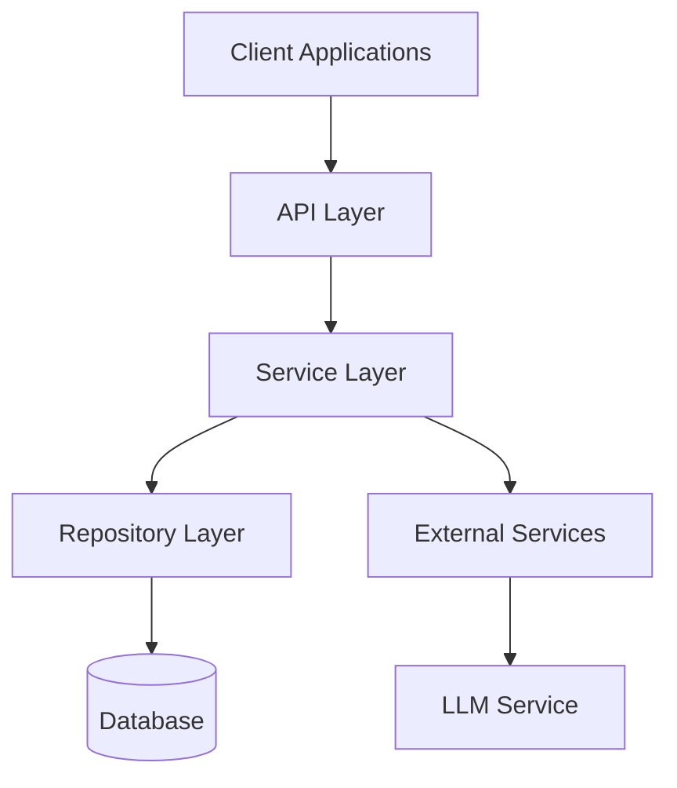

# Design Document: SSE LLM Integration & Project Restructuring

## Overview

This design document outlines the architecture and implementation details for enhancing the Solution Outline Assistant API with Server-Sent Events (SSE) for real-time LLM responses, versioned solution outlines, Architecture Decision Records (ADR), enhanced project models, and team/task management. The design focuses on creating a scalable, maintainable architecture that follows REST principles and provides a seamless user experience.

The current system is a FastAPI application that provides endpoints for managing projects, requirements, diagrams, teams, and tasks. It uses SQLAlchemy for database operations and integrates with Ollama for LLM capabilities. The design will build upon this foundation to implement the new requirements while optimizing the project structure.

## Architecture

### High-Level Architecture

The system will follow a layered architecture with clear separation of concerns:



### Components

1. **API Layer**: FastAPI routers handling HTTP requests and SSE connections
2. **Service Layer**: Business logic implementation
3. **Repository Layer**: Data access and persistence
4. **Domain Models**: Core business entities and value objects
5. **Schemas**: Data transfer objects for API requests/responses
6. **External Services**: Integration with external systems (e.g., Ollama LLM)

### Project Structure

The project will be restructured to follow a domain-driven design approach:

```
/
├── main.py                    # Application entry point
├── app/
│   ├── __init__.py
│   ├── main.py                # FastAPI application setup
│   ├── config/                # Configuration management
│   ├── core/                  # Core functionality and utilities
│   │   ├── __init__.py
│   │   ├── database.py        # Database connection management
│   │   ├── exceptions.py      # Custom exceptions
│   │   ├── security.py        # Authentication/authorization
│   │   └── events.py          # Event handling (SSE)
│   ├── domain/                # Domain models and business logic
│   │   ├── __init__.py
│   │   ├── projects/          # Project domain
│   │   ├── requirements/      # Requirements domain
│   │   ├── diagrams/          # Diagrams domain
│   │   ├── teams/             # Teams domain
│   │   ├── tasks/             # Tasks domain
│   │   ├── solution_outlines/ # Solution outlines domain
│   │   └── adrs/              # Architecture Decision Records domain
│   ├── repositories/          # Data access layer
│   │   ├── __init__.py
│   │   ├── base.py            # Base repository
│   │   ├── projects.py
│   │   ├── requirements.py
│   │   ├── diagrams.py
│   │   ├── teams.py
│   │   ├── tasks.py
│   │   ├── solution_outlines.py
│   │   └── adrs.py
│   ├── services/              # Business logic layer
│   │   ├── __init__.py
│   │   ├── projects.py
│   │   ├── requirements.py
│   │   ├── diagrams.py
│   │   ├── teams.py
│   │   ├── tasks.py
│   │   ├── solution_outlines.py
│   │   ├── adrs.py
│   │   └── llm/               # LLM integration
│   │       ├── __init__.py
│   │       ├── client.py      # Enhanced Ollama client with streaming
│   │       ├── prompts.py     # LLM prompt templates
│   │       └── streaming.py   # SSE streaming utilities
│   └── api/                   # API endpoints
│       ├── __init__.py
│       ├── dependencies.py    # FastAPI dependencies
│       ├── v1/                # API version 1
│       │   ├── __init__.py
│       │   ├── endpoints/     # API endpoints
│       │   │   ├── __init__.py
│       │   │   ├── projects.py
│       │   │   ├── requirements.py
│       │   │   ├── diagrams.py
│       │   │   ├── teams.py
│       │   │   ├── tasks.py
│       │   │   ├── solution_outlines.py
│       │   │   ├── adrs.py
│       │   │   └── assistant.py
│       │   └── router.py      # API router
│       └── schemas/           # API schemas (request/response models)
│           ├── __init__.py
│           ├── projects.py
│           ├── requirements.py
│           ├── diagrams.py
│           ├── teams.py
│           ├── tasks.py
│           ├── solution_outlines.py
│           └── adrs.py
└── tests/                     # Tests
    ├── __init__.py
    ├── conftest.py            # Test configuration
    ├── unit/                  # Unit tests
    └── integration/           # Integration tests
```

## Components and Interfaces

### Core Components

#### SSE Event Manager

The SSE Event Manager will handle the creation and management of SSE connections and events.

```python
class SSEEventManager:
    async def create_sse_connection(self, request: Request) -> EventSourceResponse:
        """Create a new SSE connection."""
        
    async def send_event(self, client_id: str, event_type: str, data: Any) -> None:
        """Send an event to a specific client."""
        
    async def broadcast_event(self, event_type: str, data: Any) -> None:
        """Broadcast an event to all connected clients."""
        
    async def close_connection(self, client_id: str) -> None:
        """Close a specific SSE connection."""
```

#### Enhanced Ollama Client

The enhanced Ollama client will support streaming responses from the LLM.

```python
class StreamingOllamaClient:
    async def generate_stream(self, prompt: str, prompt_key: str = "unknown") -> AsyncGenerator[str, None]:
        """Generate a streaming response from the LLM."""
        
    async def generate(self, prompt: str, prompt_key: str = "unknown") -> str:
        """Generate a complete response from the LLM (non-streaming)."""
```

#### Solution Outline Service

The Solution Outline Service will handle the creation, retrieval, and versioning of solution outlines.

```python
class SolutionOutlineService:
    async def create_solution_outline(self, project_id: str, content: str) -> SolutionOutline:
        """Create a new solution outline with version 1."""
        
    async def update_solution_outline(self, project_id: str, content: str) -> SolutionOutline:
        """Update a solution outline, creating a new version."""
        
    async def get_latest_solution_outline(self, project_id: str) -> SolutionOutline:
        """Get the latest version of a solution outline."""
        
    async def get_solution_outline_by_version(self, project_id: str, version: int) -> SolutionOutline:
        """Get a specific version of a solution outline."""
        
    async def get_solution_outline_versions(self, project_id: str) -> List[SolutionOutlineVersion]:
        """Get all versions of a solution outline."""
```

#### Architecture Decision Record Service

The ADR Service will manage Architecture Decision Records.

```python
class ADRService:
    async def create_adr(self, project_id: str, title: str, content: str) -> ADR:
        """Create a new ADR."""
        
    async def update_adr(self, adr_id: int, title: str, content: str) -> ADR:
        """Update an existing ADR."""
        
    async def get_adr(self, adr_id: int) -> ADR:
        """Get an ADR by ID."""
        
    async def get_adrs_for_project(self, project_id: str) -> List[ADR]:
        """Get all ADRs for a project."""
        
    async def delete_adr(self, adr_id: int) -> None:
        """Delete an ADR."""
```

#### Solution Outline Review Service

The Solution Outline Review Service will handle LLM reviews of solution outlines.

```python
class SolutionOutlineReviewService:
    async def create_review(self, solution_outline_id: int) -> AsyncGenerator[ReviewComment, None]:
        """Create a new review for a solution outline, streaming the results."""
        
    async def get_review_comments(self, solution_outline_id: int) -> List[ReviewComment]:
        """Get all review comments for a solution outline."""
        
    async def update_comment_status(self, comment_id: int, status: ReviewCommentStatus) -> ReviewComment:
        """Update the status of a review comment."""
```

### API Endpoints

#### SSE Endpoints

```python
@router.get("/sse")
async def sse_endpoint(request: Request) -> EventSourceResponse:
    """Establish an SSE connection."""
    
@router.post("/llm/stream")
async def stream_llm_response(request: LLMRequest, sse_connection: EventSourceResponse = Depends(get_sse_connection)):
    """Stream an LLM response using SSE."""
```

#### Solution Outline Endpoints

```python
@router.post("/projects/{project_id}/solution-outlines")
async def create_solution_outline(project_id: str, request: SolutionOutlineCreate):
    """Create a new solution outline."""
    
@router.get("/projects/{project_id}/solution-outlines/latest")
async def get_latest_solution_outline(project_id: str):
    """Get the latest version of a solution outline."""
    
@router.get("/projects/{project_id}/solution-outlines/{version}")
async def get_solution_outline_by_version(project_id: str, version: int):
    """Get a specific version of a solution outline."""
    
@router.get("/projects/{project_id}/solution-outlines")
async def get_solution_outline_versions(project_id: str):
    """Get all versions of a solution outline."""
```

#### ADR Endpoints

```python
@router.post("/projects/{project_id}/adrs")
async def create_adr(project_id: str, request: ADRCreate):
    """Create a new ADR."""
    
@router.get("/projects/{project_id}/adrs")
async def get_adrs(project_id: str):
    """Get all ADRs for a project."""
    
@router.get("/adrs/{adr_id}")
async def get_adr(adr_id: int):
    """Get an ADR by ID."""
    
@router.put("/adrs/{adr_id}")
async def update_adr(adr_id: int, request: ADRUpdate):
    """Update an ADR."""
    
@router.delete("/adrs/{adr_id}")
async def delete_adr(adr_id: int):
    """Delete an ADR."""
```

#### Solution Outline Review Endpoints

```python
@router.post("/solution-outlines/{solution_outline_id}/review")
async def create_review(solution_outline_id: int, request: Request) -> EventSourceResponse:
    """Create a new review for a solution outline, streaming the results."""
    
@router.get("/solution-outlines/{solution_outline_id}/review-comments")
async def get_review_comments(solution_outline_id: int):
    """Get all review comments for a solution outline."""
    
@router.put("/review-comments/{comment_id}")
async def update_comment_status(comment_id: int, request: ReviewCommentStatusUpdate):
    """Update the status of a review comment."""
```

## Data Models

### Enhanced Project Model

```python
class Project(Base):
    __tablename__ = "projects"
    id = Column(String(255), primary_key=True, index=True, unique=True)
    name = Column(String(255), nullable=False)
    description = Column(Text)
    code = Column(String(255))  # New field for project code
    state = Column(Enum(ProjectState), default=ProjectState.active)  # New field for project state
    created_at = Column(DateTime, default=datetime.utcnow)
    updated_at = Column(DateTime, default=datetime.utcnow, onupdate=datetime.utcnow)

    # Relationships
    requirements = relationship("Requirement", back_populates="project", cascade="all, delete-orphan")
    diagrams = relationship("Diagram", back_populates="project", cascade="all, delete-orphan")
    teams = relationship("Team", back_populates="project", cascade="all, delete-orphan")
    tasks = relationship("Task", back_populates="project", cascade="all, delete-orphan")
    solution_outlines = relationship("SolutionOutline", back_populates="project", cascade="all, delete-orphan")
    adrs = relationship("ADR", back_populates="project", cascade="all, delete-orphan")
```

### Solution Outline Model

```python
class SolutionOutline(Base):
    __tablename__ = "solution_outlines"
    id = Column(Integer, primary_key=True, index=True)
    project_id = Column(String(255), ForeignKey("projects.id"), nullable=False)
    content = Column(Text, nullable=False)
    version = Column(Integer, nullable=False)
    status = Column(Enum(SolutionOutlineStatus), default=SolutionOutlineStatus.draft)
    created_at = Column(DateTime, default=datetime.utcnow)
    updated_at = Column(DateTime, default=datetime.utcnow, onupdate=datetime.utcnow)

    # Relationships
    project = relationship("Project", back_populates="solution_outlines")
    review_comments = relationship("ReviewComment", back_populates="solution_outline", cascade="all, delete-orphan")

    # Composite unique constraint to ensure unique versions per project
    __table_args__ = (
        UniqueConstraint('project_id', 'version', name='uix_project_version'),
    )
```

### Architecture Decision Record Model

```python
class ADR(Base):
    __tablename__ = "adrs"
    id = Column(Integer, primary_key=True, index=True)
    project_id = Column(String(255), ForeignKey("projects.id"), nullable=False)
    title = Column(String(255), nullable=False)
    content = Column(Text, nullable=False)
    created_at = Column(DateTime, default=datetime.utcnow)
    updated_at = Column(DateTime, default=datetime.utcnow, onupdate=datetime.utcnow)

    # Relationships
    project = relationship("Project", back_populates="adrs")
```

### Review Comment Model

```python
class ReviewComment(Base):
    __tablename__ = "review_comments"
    id = Column(Integer, primary_key=True, index=True)
    solution_outline_id = Column(Integer, ForeignKey("solution_outlines.id"), nullable=False)
    content = Column(Text, nullable=False)
    status = Column(Enum(ReviewCommentStatus), default=ReviewCommentStatus.pending)
    created_at = Column(DateTime, default=datetime.utcnow)
    updated_at = Column(DateTime, default=datetime.utcnow, onupdate=datetime.utcnow)

    # Relationships
    solution_outline = relationship("SolutionOutline", back_populates="review_comments")
```

## SSE Implementation

### SSE Connection Management

The SSE connection management will be implemented using FastAPI's `EventSourceResponse` from the `sse_starlette` package. The implementation will include:

1. Connection establishment
2. Client tracking
3. Event broadcasting
4. Connection cleanup

```python
from sse_starlette.sse import EventSourceResponse
from fastapi import Request
import asyncio
import uuid
from typing import Dict, Any, AsyncGenerator

class SSEManager:
    def __init__(self):
        self.clients: Dict[str, asyncio.Queue] = {}
        
    async def register_client(self, request: Request) -> tuple[str, EventSourceResponse]:
        """Register a new client and return the client ID and EventSourceResponse."""
        client_id = str(uuid.uuid4())
        queue = asyncio.Queue()
        self.clients[client_id] = queue
        
        async def event_generator():
            try:
                while True:
                    if await request.is_disconnected():
                        break
                    
                    event = await queue.get()
                    if event is None:  # None is our signal to close the connection
                        break
                        
                    yield event
            finally:
                await self.unregister_client(client_id)
                
        return client_id, EventSourceResponse(event_generator())
        
    async def unregister_client(self, client_id: str) -> None:
        """Unregister a client."""
        if client_id in self.clients:
            await self.clients[client_id].put(None)  # Signal to close
            del self.clients[client_id]
            
    async def send_event(self, client_id: str, event_type: str, data: Any) -> None:
        """Send an event to a specific client."""
        if client_id in self.clients:
            await self.clients[client_id].put({
                "event": event_type,
                "data": data
            })
            
    async def broadcast_event(self, event_type: str, data: Any) -> None:
        """Broadcast an event to all connected clients."""
        for client_id in list(self.clients.keys()):
            await self.send_event(client_id, event_type, data)
```

### LLM Streaming Integration

The LLM streaming integration will connect the Ollama client with the SSE manager to stream responses in real-time:

```python
async def stream_llm_response(
    prompt: str,
    client_id: str,
    sse_manager: SSEManager,
    ollama_client: StreamingOllamaClient
) -> None:
    """Stream an LLM response to a client using SSE."""
    try:
        # Send initial event
        await sse_manager.send_event(client_id, "start", {"message": "Starting LLM processing"})
        
        # Stream the response
        async for chunk in ollama_client.generate_stream(prompt):
            await sse_manager.send_event(client_id, "chunk", {"content": chunk})
            
        # Send completion event
        await sse_manager.send_event(client_id, "complete", {"message": "LLM processing complete"})
    except Exception as e:
        # Send error event
        await sse_manager.send_event(client_id, "error", {"message": str(e)})
```

## Error Handling

### Exception Hierarchy

```python
class AppException(Exception):
    """Base exception for all application exceptions."""
    def __init__(self, message: str, status_code: int = 500):
        self.message = message
        self.status_code = status_code
        super().__init__(self.message)

class NotFoundException(AppException):
    """Exception raised when a resource is not found."""
    def __init__(self, message: str):
        super().__init__(message, status_code=404)

class BadRequestException(AppException):
    """Exception raised when a request is invalid."""
    def __init__(self, message: str):
        super().__init__(message, status_code=400)

class UnauthorizedException(AppException):
    """Exception raised when a user is not authorized."""
    def __init__(self, message: str = "Unauthorized"):
        super().__init__(message, status_code=401)

class ForbiddenException(AppException):
    """Exception raised when a user is forbidden from accessing a resource."""
    def __init__(self, message: str = "Forbidden"):
        super().__init__(message, status_code=403)

class LLMException(AppException):
    """Exception raised when there is an error with the LLM."""
    def __init__(self, message: str):
        super().__init__(message, status_code=500)
```

### Global Exception Handler

```python
@app.exception_handler(AppException)
async def app_exception_handler(request: Request, exc: AppException):
    return JSONResponse(
        status_code=exc.status_code,
        content={"detail": exc.message}
    )

@app.exception_handler(RequestValidationError)
async def validation_exception_handler(request: Request, exc: RequestValidationError):
    return JSONResponse(
        status_code=422,
        content={"detail": jsonable_encoder(exc.errors())}
    )

@app.exception_handler(Exception)
async def global_exception_handler(request: Request, exc: Exception):
    logger.error(f"Unhandled exception: {exc}", exc_info=True)
    return JSONResponse(
        status_code=500,
        content={"detail": "Internal server error"}
    )
```

## Testing Strategy

### Unit Testing

Unit tests will focus on testing individual components in isolation:

1. **Service Layer Tests**: Test business logic without external dependencies
2. **Repository Layer Tests**: Test data access with a test database
3. **API Layer Tests**: Test API endpoints with mocked services

### Integration Testing

Integration tests will focus on testing the interaction between components:

1. **API Integration Tests**: Test API endpoints with real services and a test database
2. **LLM Integration Tests**: Test LLM integration with a mock LLM service
3. **SSE Integration Tests**: Test SSE functionality with a mock client

### End-to-End Testing

End-to-end tests will focus on testing the entire system:

1. **API E2E Tests**: Test API endpoints with a real database
2. **SSE E2E Tests**: Test SSE functionality with a real client

## Implementation Considerations

### Database Migrations

Database migrations will be implemented using Alembic to manage schema changes:

```python
# alembic/env.py
from alembic import context
from app.core.database import Base
from app.domain.models import *  # Import all models

target_metadata = Base.metadata

# ... rest of the Alembic configuration
```

### Dependency Injection

Dependency injection will be used to manage dependencies and improve testability:

```python
# app/api/dependencies.py
from fastapi import Depends
from sqlalchemy.orm import Session
from app.core.database import get_db
from app.repositories.projects import ProjectRepository
from app.services.projects import ProjectService

def get_project_repository(db: Session = Depends(get_db)) -> ProjectRepository:
    return ProjectRepository(db)

def get_project_service(repo: ProjectRepository = Depends(get_project_repository)) -> ProjectService:
    return ProjectService(repo)
```

### Authentication and Authorization

Authentication and authorization will be implemented using JWT tokens:

```python
# app/core/security.py
from fastapi import Depends, HTTPException, status
from fastapi.security import OAuth2PasswordBearer
from jose import JWTError, jwt
from datetime import datetime, timedelta
from typing import Optional

# ... JWT configuration and functions

oauth2_scheme = OAuth2PasswordBearer(tokenUrl="token")

async def get_current_user(token: str = Depends(oauth2_scheme)):
    credentials_exception = HTTPException(
        status_code=status.HTTP_401_UNAUTHORIZED,
        detail="Could not validate credentials",
        headers={"WWW-Authenticate": "Bearer"},
    )
    try:
        payload = jwt.decode(token, SECRET_KEY, algorithms=[ALGORITHM])
        username: str = payload.get("sub")
        if username is None:
            raise credentials_exception
    except JWTError:
        raise credentials_exception
    
    # Get user from database
    # ...
    
    return user
```

## Conclusion

This design document outlines a comprehensive approach to implementing the required features while optimizing the project structure. The design focuses on creating a scalable, maintainable architecture that follows REST principles and provides a seamless user experience.

The implementation will be phased, starting with the project restructuring, followed by the SSE implementation, and then the additional features (versioned solution outlines, ADRs, enhanced project models, and team/task management).