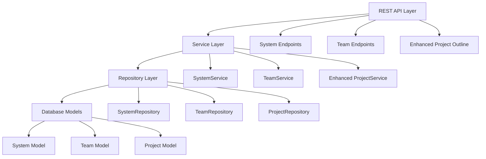
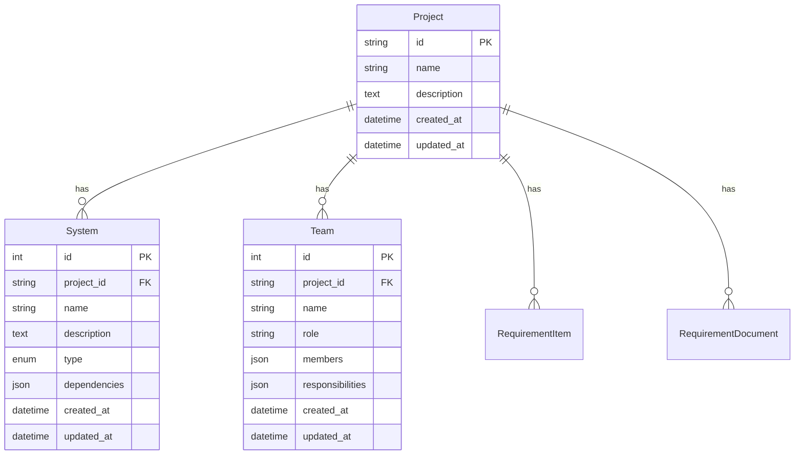

# Design Document

## Overview

The Systems and Teams Management feature extends the existing project management platform with comprehensive tracking capabilities for project systems and teams. This design follows the established repository-service-API pattern used throughout the application, ensuring consistency with existing components like RequirementItem management.

The feature introduces two new domain entities (System and Team) with full CRUD operations via REST API, enhanced project outline functionality, and maintains data integrity through proper foreign key relationships with the existing Project model.

## Architecture

### High-Level Architecture



### Data Flow

1. **API Layer**: Receives HTTP requests, validates input schemas, and delegates to services
2. **Service Layer**: Implements business logic, handles upsert operations, and coordinates between repositories
3. **Repository Layer**: Manages database operations, queries, and data persistence
4. **Model Layer**: Defines database schema, relationships, and constraints

## Components and Interfaces

### Domain Models

#### System Model
```python
class SystemType(enum.Enum):
    internal = "internal"
    external = "external"
    integration = "integration"

class System(Base):
    __tablename__ = "systems"
    
    id = Column(Integer, primary_key=True, index=True)
    project_id = Column(String(255), ForeignKey("projects.id"), nullable=False)
    name = Column(String(255), nullable=False)
    description = Column(Text, nullable=True)
    type = Column(Enum(SystemType), nullable=False)
    dependencies = Column(JSON, default=list)  # List of system IDs or names
    created_at = Column(DateTime, default=datetime.utcnow)
    updated_at = Column(DateTime, default=datetime.utcnow, onupdate=datetime.utcnow)
    
    # Relationships
    project = relationship("Project", back_populates="systems")
    
    # Constraints
    __table_args__ = (
        UniqueConstraint('project_id', 'name', name='uq_system_project_name'),
    )
```

#### Team Model
```python
class Team(Base):
    __tablename__ = "teams"
    
    id = Column(Integer, primary_key=True, index=True)
    project_id = Column(String(255), ForeignKey("projects.id"), nullable=False)
    name = Column(String(255), nullable=False)
    role = Column(String(255), nullable=False)
    members = Column(JSON, default=list)  # List of member names (strings)
    responsibilities = Column(JSON, default=list)  # List of responsibility descriptions
    created_at = Column(DateTime, default=datetime.utcnow)
    updated_at = Column(DateTime, default=datetime.utcnow, onupdate=datetime.utcnow)
    
    # Relationships
    project = relationship("Project", back_populates="teams")
    
    # Constraints
    __table_args__ = (
        UniqueConstraint('project_id', 'name', name='uq_team_project_name'),
    )
```

### API Schemas

#### System Schemas
```python
class SystemCreate(BaseModel):
    project_id: str
    name: str
    description: Optional[str] = None
    type: SystemType
    dependencies: List[str] = []

class SystemUpdate(BaseModel):
    name: Optional[str] = None
    description: Optional[str] = None
    type: Optional[SystemType] = None
    dependencies: Optional[List[str]] = None

class SystemUpsert(BaseModel):
    project_id: str
    name: str
    description: Optional[str] = None
    type: SystemType
    dependencies: List[str] = []

class SystemResponse(BaseModel):
    id: int
    project_id: str
    name: str
    description: Optional[str]
    type: SystemType
    dependencies: List[str]
    created_at: datetime
    updated_at: datetime
```

#### Team Schemas
```python
class TeamCreate(BaseModel):
    project_id: str
    name: str
    role: str
    members: List[str] = []
    responsibilities: List[str] = []

class TeamUpdate(BaseModel):
    name: Optional[str] = None
    role: Optional[str] = None
    members: Optional[List[str]] = None
    responsibilities: Optional[List[str]] = None

class TeamUpsert(BaseModel):
    project_id: str
    name: str
    role: str
    members: List[str] = []
    responsibilities: List[str] = []

class TeamResponse(BaseModel):
    id: int
    project_id: str
    name: str
    role: str
    members: List[str]
    responsibilities: List[str]
    created_at: datetime
    updated_at: datetime
```

### Repository Layer

#### SystemRepository
```python
class SystemRepository:
    def create(self, db: Session, system_data: SystemCreate) -> System
    def get_by_id(self, db: Session, system_id: int) -> Optional[System]
    def get_by_project_and_name(self, db: Session, project_id: str, name: str) -> Optional[System]
    def get_by_project(self, db: Session, project_id: str, skip: int = 0, limit: int = 100) -> List[System]
    def update(self, db: Session, system_id: int, system_data: SystemUpdate) -> System
    def delete(self, db: Session, system_id: int) -> bool
    def search(self, db: Session, project_id: str, filters: dict, skip: int = 0, limit: int = 100) -> List[System]
    def validate_dependencies(self, db: Session, project_id: str, dependencies: List[str]) -> bool
```

#### TeamRepository
```python
class TeamRepository:
    def create(self, db: Session, team_data: TeamCreate) -> Team
    def get_by_id(self, db: Session, team_id: int) -> Optional[Team]
    def get_by_project_and_name(self, db: Session, project_id: str, name: str) -> Optional[Team]
    def get_by_project(self, db: Session, project_id: str, skip: int = 0, limit: int = 100) -> List[Team]
    def update(self, db: Session, team_id: int, team_data: TeamUpdate) -> Team
    def delete(self, db: Session, team_id: int) -> bool
    def search(self, db: Session, project_id: str, filters: dict, skip: int = 0, limit: int = 100) -> List[Team]
```

### Service Layer

#### SystemService
```python
class SystemService:
    def create_system(self, db: Session, system_data: SystemCreate) -> SystemResponse
    def get_system(self, db: Session, system_id: int) -> SystemResponse
    def upsert_system(self, db: Session, system_data: SystemUpsert) -> SystemResponse
    def update_system(self, db: Session, system_id: int, system_data: SystemUpdate) -> SystemResponse
    def delete_system(self, db: Session, system_id: int) -> bool
    def list_systems(self, db: Session, project_id: str, filters: dict, skip: int, limit: int) -> List[SystemResponse]
    def validate_system_dependencies(self, db: Session, project_id: str, dependencies: List[str]) -> bool
```

#### TeamService
```python
class TeamService:
    def create_team(self, db: Session, team_data: TeamCreate) -> TeamResponse
    def get_team(self, db: Session, team_id: int) -> TeamResponse
    def upsert_team(self, db: Session, team_data: TeamUpsert) -> TeamResponse
    def update_team(self, db: Session, team_id: int, team_data: TeamUpdate) -> TeamResponse
    def delete_team(self, db: Session, team_id: int) -> bool
    def list_teams(self, db: Session, project_id: str, filters: dict, skip: int, limit: int) -> List[TeamResponse]
```

### API Endpoints

#### System Endpoints
- `POST /api/v1/systems` - Create system
- `PUT /api/v1/systems` - Upsert system (create or update by project_id + name)
- `GET /api/v1/systems/{system_id}` - Get system by ID
- `GET /api/v1/systems` - List systems with filtering and pagination
- `PATCH /api/v1/systems/{system_id}` - Update system
- `DELETE /api/v1/systems/{system_id}` - Delete system

#### Team Endpoints
- `POST /api/v1/teams` - Create team
- `PUT /api/v1/teams` - Upsert team (create or update by project_id + name)
- `GET /api/v1/teams/{team_id}` - Get team by ID
- `GET /api/v1/teams` - List teams with filtering and pagination
- `PATCH /api/v1/teams/{team_id}` - Update team
- `DELETE /api/v1/teams/{team_id}` - Delete team

#### Enhanced Project Outline
- `GET /api/v1/projects/{project_id}/outline` - Enhanced project outline including systems and teams

## Data Models

### Database Schema Updates

#### Project Model Enhancement
```python
# Add to existing Project model relationships
systems = relationship("System", back_populates="project", cascade="all, delete-orphan")
teams = relationship("Team", back_populates="project", cascade="all, delete-orphan")
```

#### Enhanced Project Outline Response
```python
class ProjectOutlineResponse(BaseModel):
    project: ProjectResponse
    solution_outline: Optional[SolutionOutlineResponse] = None
    requirements: RequirementsOutlineResponse
    systems: List[SystemResponse] = []
    teams: List[TeamResponse] = []
    
class SolutionOutlineResponse(BaseModel):
    latest_version: int
    status: str
    content: Optional[str] = None
    
class RequirementsOutlineResponse(BaseModel):
    total_count: int
    status_breakdown: Dict[str, int]
    latest_version: Optional[int] = None
    items: List[RequirementItemResponse] = []
```

### Data Relationships



## Error Handling

### Exception Types
- `SystemNotFoundException`: When system ID doesn't exist
- `TeamNotFoundException`: When team ID doesn't exist
- `DuplicateSystemException`: When system name already exists in project
- `DuplicateTeamException`: When team name already exists in project
- `InvalidDependencyException`: When system dependency references don't exist
- `ValidationException`: When input data fails validation

### Error Response Format
```python
class ErrorResponse(BaseModel):
    error: str
    message: str
    details: Optional[Dict[str, Any]] = None
    timestamp: datetime
```

### HTTP Status Codes
- `200 OK`: Successful GET, PATCH operations
- `201 Created`: Successful POST operations
- `204 No Content`: Successful DELETE operations
- `400 Bad Request`: Validation errors, invalid dependencies
- `404 Not Found`: Resource not found
- `409 Conflict`: Duplicate name constraints
- `422 Unprocessable Entity`: Schema validation errors
- `500 Internal Server Error`: Unexpected server errors

## Testing Strategy

### Unit Tests
- **Model Tests**: Validate model creation, relationships, and constraints
- **Repository Tests**: Test CRUD operations, filtering, and search functionality
- **Service Tests**: Verify business logic, upsert operations, and error handling
- **Schema Tests**: Validate API schema serialization and validation

### Integration Tests
- **API Endpoint Tests**: Test complete request-response cycles
- **Database Integration**: Verify database operations and transactions
- **Cross-Component Tests**: Test interactions between systems, teams, and projects

### End-to-End Tests
- **System Management Workflow**: Create, update, delete systems with dependencies
- **Team Management Workflow**: Create, update, delete teams with members
- **Project Outline Integration**: Verify enhanced project outline includes all components
- **Upsert Operations**: Test create-or-update functionality for both systems and teams

### Performance Tests
- **Load Testing**: Test API performance under concurrent requests
- **Database Performance**: Verify query performance with large datasets
- **Memory Usage**: Monitor memory consumption during bulk operations

### Test Data Management
- **Fixtures**: Reusable test data for projects, systems, and teams
- **Factory Pattern**: Dynamic test data generation
- **Cleanup**: Proper test data cleanup to prevent test interference

This design ensures scalability, maintainability, and consistency with the existing codebase while providing comprehensive systems and teams management capabilities.