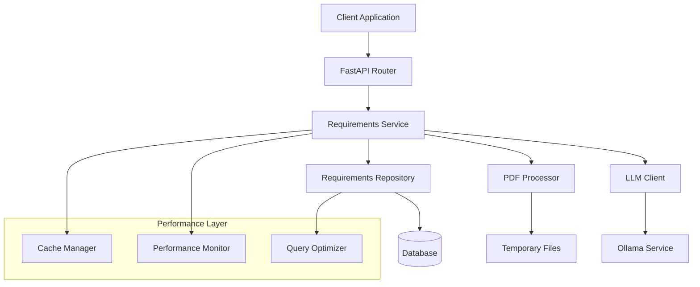

# Requirements Versioning and PDF Upload System

## Overview

The Requirements Versioning and PDF Upload System is a comprehensive solution for managing versioned requirements documents with automatic PDF processing and LLM-powered conversion capabilities. This system provides a complete API for creating, managing, and tracking requirements documents with full version history and advanced features.

## Table of Contents

1. [Features](#features)
2. [Architecture](#architecture)
3. [API Documentation](#api-documentation)
4. [Database Schema](#database-schema)
5. [Performance Optimizations](#performance-optimizations)
6. [Monitoring and Alerting](#monitoring-and-alerting)
7. [Installation and Setup](#installation-and-setup)
8. [Usage Examples](#usage-examples)
9. [Migration Guide](#migration-guide)
10. [Troubleshooting](#troubleshooting)

## Features

### Core Functionality
- **Versioned Requirements Management**: Automatic version tracking with complete history
- **PDF Upload and Conversion**: Upload PDF files and convert to structured markdown using LLM
- **Upsert API**: Single endpoint for both creating and updating requirements
- **Advanced Querying**: Pagination, filtering, and search capabilities
- **Status Management**: Draft, published, and archived workflow states
- **Source Tracking**: Distinguish between manual and PDF-uploaded requirements

### Advanced Features
- **Performance Optimization**: Intelligent caching and resource management
- **Monitoring and Alerting**: Comprehensive system monitoring with health checks
- **Concurrent Processing**: Controlled concurrent PDF uploads
- **Error Handling**: Robust error handling with detailed error messages
- **Database Migration**: Safe database migrations with rollback capabilities

## Architecture

### System Components



### Layer Architecture

1. **API Layer**: FastAPI routers handling HTTP requests
2. **Service Layer**: Business logic and orchestration
3. **Repository Layer**: Data access and persistence
4. **Processing Layer**: PDF processing and LLM integration
5. **Performance Layer**: Caching, monitoring, and optimization
6. **Database Layer**: SQLite with optimized schema and indexes

## API Documentation

### Base URL
```
/api/v1/projects/{project_id}/requirements
```

### Core Endpoints

#### Create/Update Requirements (Upsert)
```http
POST /api/v1/projects/{project_id}/requirements
```

**Parameters:**
- `content` (required): Markdown content of the requirements
- `status` (optional): Document status (draft, published, archived)

**Response:**
```json
{
  "id": 1,
  "project_id": "my-project",
  "content": "# Requirements Document\n\n1. User authentication",
  "version": 1,
  "status": "draft",
  "source_type": "manual",
  "original_filename": null,
  "created_at": "2023-01-01T00:00:00Z",
  "updated_at": "2023-01-01T00:00:00Z"
}
```

#### Upload PDF
```http
POST /api/v1/projects/{project_id}/requirements/upload-pdf
```

**Request:** `multipart/form-data`
- `file` (required): PDF file (max 10MB)
- `status` (optional): Document status

**Response:** Same as create/update requirements

#### Get Latest Requirements
```http
GET /api/v1/projects/{project_id}/requirements/latest
```

Returns the latest version or an empty document if none exists.

#### Get Specific Version
```http
GET /api/v1/projects/{project_id}/requirements/{version}
```

#### List All Versions
```http
GET /api/v1/projects/{project_id}/requirements
```

**Query Parameters:**
- `page` (optional): Page number (default: 1)
- `per_page` (optional): Items per page (default: 20, max: 100)
- `status_filter` (optional): Filter by status
- `source_type_filter` (optional): Filter by source type

#### Update Status
```http
PATCH /api/v1/projects/{project_id}/requirements/{document_id}/status
```

**Parameters:**
- `new_status` (required): New status value

#### Delete Version
```http
DELETE /api/v1/projects/{project_id}/requirements/{version}
```

#### Get Summary
```http
GET /api/v1/projects/{project_id}/requirements/summary
```

Returns summary statistics including version counts and status distribution.

### Monitoring Endpoints

#### Health Check
```http
GET /api/v1/monitoring/health
```

Returns system health status and score.

#### Performance Metrics
```http
GET /api/v1/monitoring/metrics
```

Returns detailed performance metrics for all operations.

#### System Metrics
```http
GET /api/v1/monitoring/system
```

Returns system resource usage (CPU, memory, disk).

#### Cache Statistics
```http
GET /api/v1/monitoring/cache
```

Returns cache performance statistics and hit rates.

## Database Schema

### requirement_documents Table

```sql
CREATE TABLE requirement_documents (
    id INTEGER PRIMARY KEY AUTOINCREMENT,
    project_id VARCHAR(255) NOT NULL,
    content TEXT NOT NULL,
    version INTEGER NOT NULL,
    status VARCHAR(50) DEFAULT 'draft',
    source_type VARCHAR(50) DEFAULT 'manual',
    original_filename VARCHAR(255),
    created_at DATETIME DEFAULT CURRENT_TIMESTAMP,
    updated_at DATETIME DEFAULT CURRENT_TIMESTAMP,
    
    UNIQUE(project_id, version),
    CHECK (version > 0),
    CHECK (length(content) > 0)
);
```

### Indexes

```sql
-- Performance-optimized indexes
CREATE INDEX idx_requirement_documents_project_version 
ON requirement_documents(project_id, version);

CREATE INDEX idx_requirement_documents_project_created 
ON requirement_documents(project_id, created_at DESC);

CREATE INDEX idx_requirement_documents_status 
ON requirement_documents(status);

CREATE INDEX idx_requirement_documents_source_type 
ON requirement_documents(source_type);
```

## Performance Optimizations

### Caching Strategy

The system implements intelligent caching at multiple levels:

1. **Project Validation Cache**: Cache project existence checks (TTL: 5 minutes)
2. **Latest Requirements Cache**: Cache frequently accessed latest versions (TTL: 1 minute)
3. **Version List Cache**: Cache paginated version lists (TTL: 30 seconds)
4. **Summary Cache**: Cache summary statistics (TTL: 5 minutes)

### Database Optimizations

1. **Query Optimization**: Optimized queries for common operations
2. **Index Strategy**: Strategic indexes for performance-critical queries
3. **Connection Pooling**: Efficient database connection management
4. **Pagination**: Efficient pagination with proper LIMIT/OFFSET usage

### PDF Processing Optimizations

1. **Enhanced Processing**: LangChain integration with multiple PDF loaders
2. **Resource Limits**: 10MB file size limit, 30-second timeout
3. **Concurrent Processing**: Controlled concurrent uploads (max 3)
4. **Text Optimization**: Intelligent text cleaning and chunking
5. **Memory Management**: Automatic cleanup of temporary files
6. **Automatic Fallback**: Falls back to PyMuPDF if LangChain unavailable

#### PDF Processing Options

| Feature | PyMuPDF | LangChain |
|---------|---------|-----------|
| Basic text extraction | ✅ | ✅ |
| Multi-page support | ✅ | ✅ |
| Enhanced metadata | ⚠️ Basic | ✅ Advanced |
| Text chunking | ❌ | ✅ |
| Multiple loaders | ❌ | ✅ |
| Document structure | ⚠️ Basic | ✅ Advanced |
| Memory efficiency | ✅ High | ⚠️ Medium |
| Installation | ✅ Simple | ⚠️ Complex |

**Recommendation**: Use LangChain for enhanced PDF processing capabilities. The system automatically falls back to PyMuPDF if LangChain is not available.

### LLM Processing Optimizations

1. **Prompt Optimization**: Intelligent prompt size management
2. **Retry Strategy**: Exponential backoff with jitter
3. **Timeout Handling**: Configurable timeouts for LLM calls
4. **Error Recovery**: Graceful fallback mechanisms

## Monitoring and Alerting

### Performance Monitoring

The system provides comprehensive monitoring capabilities:

1. **Operation Timing**: Automatic timing for all operations
2. **Resource Usage**: CPU, memory, and disk monitoring
3. **Cache Performance**: Hit rates and memory usage
4. **Error Tracking**: Error rates and patterns
5. **Health Scoring**: Overall system health assessment

### Alert Thresholds

| Metric | Warning | Critical |
|--------|---------|----------|
| Response Time | 2.0s | 5.0s |
| PDF Processing | 15.0s | 30.0s |
| Memory Usage | 80% | 90% |
| Cache Hit Rate | 70% | 50% |
| Error Rate | 10/min | 25/min |

### Monitoring Dashboard

Access the monitoring dashboard at:
```
GET /api/v1/monitoring/dashboard
```

The dashboard provides:
- Real-time system health score
- Performance metrics and trends
- Resource usage statistics
- Recent alerts and warnings
- Cache performance analytics

## Installation and Setup

### Prerequisites

- Python 3.8+
- SQLite 3.x
- Ollama (for LLM functionality)
- PDF Processing (choose one):
  - **LangChain** (recommended): Enhanced PDF processing with multiple loaders
  - **PyMuPDF** (fallback): Basic PDF processing with minimal dependencies

### Installation Steps

1. **Install Dependencies**
   ```bash
   # Basic installation
   pip install -r requirements.txt
   
   # Enhanced PDF processing with LangChain (recommended)
   pip install -r requirements-langchain.txt
   ```

2. **Run Database Migration**
   ```bash
   python migrate_database.py
   ```

3. **Start the Application**
   ```bash
   uvicorn app.main:app --host 0.0.0.0 --port 8000
   ```

4. **Verify Installation**
   ```bash
   curl http://localhost:8000/api/v1/monitoring/health
   ```

### Configuration

Environment variables:
- `DATABASE_URL`: Database connection string (default: sqlite:///app.db)
- `OLLAMA_BASE_URL`: Ollama service URL (default: http://localhost:11434)
- `MAX_PDF_SIZE`: Maximum PDF file size in bytes (default: 10MB)
- `PDF_TIMEOUT`: PDF processing timeout in seconds (default: 30)

## Usage Examples

### Basic Requirements Management

```python
import requests

base_url = "http://localhost:8000/api/v1"
project_id = "my-project"

# Create initial requirements
response = requests.post(
    f"{base_url}/projects/{project_id}/requirements",
    params={
        "content": "# My Requirements\n\n1. User authentication\n2. Data storage",
        "status": "draft"
    }
)
print(f"Created version: {response.json()['version']}")

# Update requirements (creates new version)
response = requests.post(
    f"{base_url}/projects/{project_id}/requirements",
    params={
        "content": "# My Requirements\n\n1. User authentication\n2. Data storage\n3. User management",
        "status": "draft"
    }
)
print(f"Updated to version: {response.json()['version']}")

# Get latest requirements
response = requests.get(f"{base_url}/projects/{project_id}/requirements/latest")
latest = response.json()
print(f"Latest version: {latest['version']}")

# List all versions
response = requests.get(
    f"{base_url}/projects/{project_id}/requirements",
    params={"page": 1, "per_page": 10}
)
versions = response.json()
print(f"Total versions: {versions['total']}")
```

### PDF Upload

```python
# Upload PDF file
with open("requirements.pdf", "rb") as pdf_file:
    response = requests.post(
        f"{base_url}/projects/{project_id}/requirements/upload-pdf",
        files={"file": ("requirements.pdf", pdf_file, "application/pdf")},
        params={"status": "draft"}
    )

if response.status_code == 201:
    pdf_doc = response.json()
    print(f"PDF converted to version: {pdf_doc['version']}")
    print(f"Original filename: {pdf_doc['original_filename']}")
```

### Monitoring

```python
# Check system health
response = requests.get(f"{base_url}/monitoring/health")
health = response.json()
print(f"System health: {health['status']} (score: {health['health_score']})")

# Get performance metrics
response = requests.get(f"{base_url}/monitoring/metrics")
metrics = response.json()
print(f"Performance metrics: {len(metrics['performance_metrics'])} operations tracked")

# Get cache statistics
response = requests.get(f"{base_url}/monitoring/cache")
cache_stats = response.json()
print(f"Cache hit rate: {cache_stats['statistics']['hit_rate']:.2%}")
```

## Migration Guide

### From Existing Requirements System

If you have an existing requirements system, follow these steps:

1. **Backup Existing Data**
   ```bash
   sqlite3 app.db ".backup backup.db"
   ```

2. **Run Migration**
   ```bash
   python migrate_database.py
   ```

3. **Verify Migration**
   ```bash
   python -c "
   from app.core.database import get_db
   from app.repositories.requirement_document_repository import RequirementDocumentRepository
   
   db = next(get_db())
   repo = RequirementDocumentRepository()
   
   # Check migrated data
   for project_id in ['project1', 'project2']:  # Your project IDs
       latest = repo.get_latest_version(db, project_id)
       if latest:
           print(f'Project {project_id}: {latest.version} versions')
   "
   ```

### Rollback Procedure

If you need to rollback the migration:

```bash
python rollback_migration.py
```

Follow the prompts to select the target version for rollback.

## Troubleshooting

### Common Issues

#### PDF Upload Fails
**Symptoms**: PDF upload returns 400 or 422 errors
**Solutions**:
1. Check file size (must be < 10MB)
2. Verify file is a valid PDF
3. Ensure Ollama service is running
4. Check PDF processing logs

#### Slow Performance
**Symptoms**: API responses are slow
**Solutions**:
1. Check system resources via `/monitoring/system`
2. Review cache hit rates via `/monitoring/cache`
3. Clear cache if needed: `POST /monitoring/cache/clear`
4. Check database indexes

#### High Memory Usage
**Symptoms**: Memory usage alerts
**Solutions**:
1. Trigger cleanup: `POST /monitoring/cleanup`
2. Restart the application
3. Review concurrent upload limits
4. Check for memory leaks in logs

#### Database Errors
**Symptoms**: Database connection or constraint errors
**Solutions**:
1. Check database file permissions
2. Verify database schema with migration status
3. Run database integrity check
4. Consider database vacuum operation

### Logging

The system provides comprehensive logging:

- **Application logs**: `app.log`
- **Performance logs**: `performance.log`
- **Migration logs**: `migration.log`
- **Rollback logs**: `rollback.log`

### Debug Mode

Enable debug mode for detailed logging:
```bash
export LOG_LEVEL=DEBUG
uvicorn app.main:app --log-level debug
```

### Health Checks

Regular health checks:
```bash
# System health
curl http://localhost:8000/api/v1/monitoring/health

# Detailed metrics
curl http://localhost:8000/api/v1/monitoring/dashboard

# Cache status
curl http://localhost:8000/api/v1/monitoring/cache
```

## Support and Maintenance

### Regular Maintenance Tasks

1. **Database Cleanup** (weekly)
   ```bash
   sqlite3 app.db "VACUUM;"
   ```

2. **Log Rotation** (daily)
   ```bash
   logrotate /etc/logrotate.d/requirements-system
   ```

3. **Performance Review** (monthly)
   - Review monitoring dashboard
   - Analyze performance trends
   - Optimize cache settings
   - Update alert thresholds

4. **Backup** (daily)
   ```bash
   sqlite3 app.db ".backup backups/app_$(date +%Y%m%d).db"
   ```

### Performance Tuning

1. **Cache Optimization**
   - Monitor hit rates
   - Adjust TTL values
   - Increase cache size if needed

2. **Database Optimization**
   - Analyze query performance
   - Add indexes for new query patterns
   - Consider database partitioning for large datasets

3. **Resource Allocation**
   - Monitor system resources
   - Adjust concurrent processing limits
   - Scale horizontally if needed

For additional support, refer to the system logs and monitoring endpoints for detailed diagnostic information.